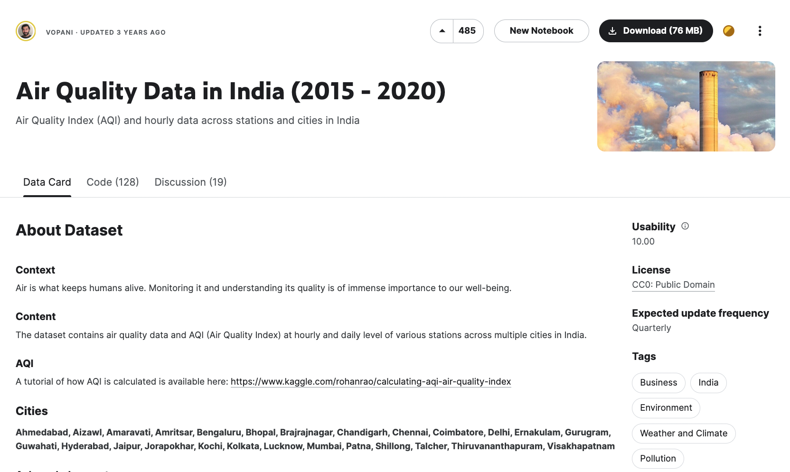

# AQI Time-Series Prediction (Dicoding Belajar Pengembangan Machine Learning - 2023) ✨

Data is acquired from <a href = 'https://www.kaggle.com/datasets/rohanrao/air-quality-data-in-india' target = 'blank'>Kaggle</a> and utilized the station_hour.csv file to predict the Air Quality Index (AQI). AQI will be predicted based on the data of the TG003 station, with details of the station can be found in the Dataset link in Kaggle.

<a href = 'https://www.kaggle.com/datasets/rohanrao/air-quality-data-in-india' target = 'blank'></a>


## Setup environment
```
conda create --name main-ds python=3.9
conda activate main-ds
pip install numpy pandas plotly matplotlib seaborn jupyter tensorflow sklearn keras statsmodels
jupyter notebook
```


